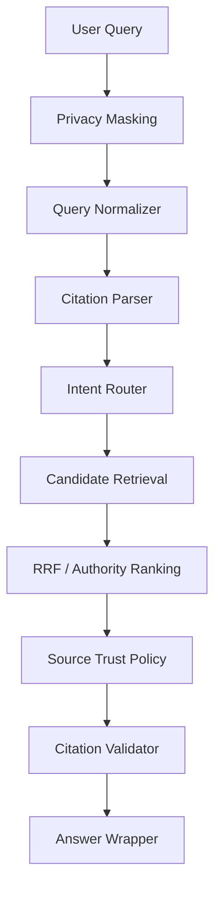

# Architecture Diagram

```mermaid
flowchart TD
  A["User Query"] --> B["Privacy Masking"]
  B --> C["Query Normalizer"]
  C --> D["Citation Parser"]
  D --> E["Intent Router"]
  E --> F["Candidate Retrieval"]
  F --> G["RRF / Authority Ranking"]
  G --> H["Source Trust Policy"]
  H --> I["Citation Validator"]
  I --> J["Answer Wrapper"]
```
