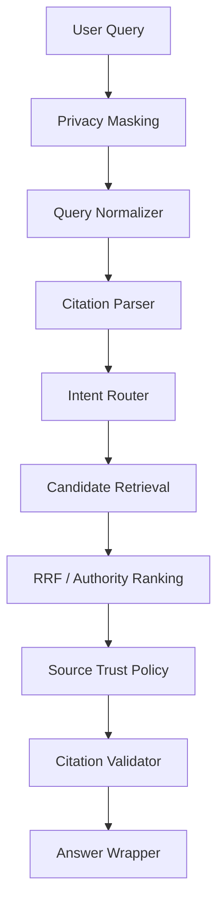

# Architecture Diagram

> 適用版本：v1.0.0（套件 `1.0.0`）；功能與限制見 [1.0 說明](V1_RELEASE.md)。

```mermaid
flowchart TD
  A["User Query"] --> B["Privacy Masking"]
  B --> C["Query Normalizer"]
  C --> D["Citation Parser"]
  D --> E["Intent Router"]
  E --> F["Candidate Retrieval"]
  F --> G["RRF / Authority Ranking"]
  G --> H["Source Trust Policy"]
  H --> I["Citation Validator"]
  I --> J["Answer Wrapper"]
```
